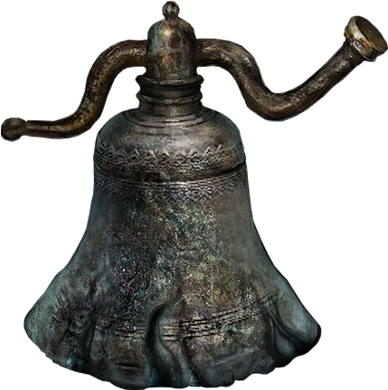
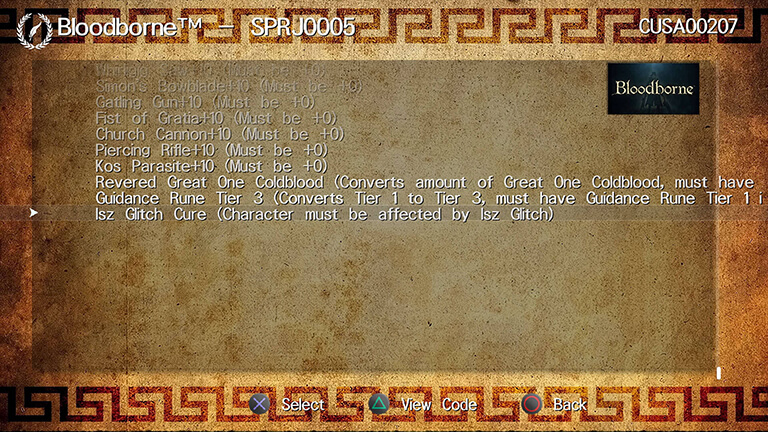
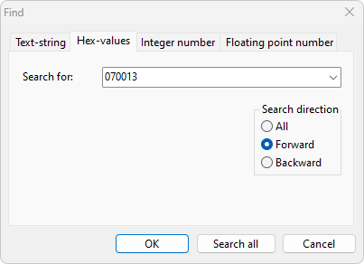
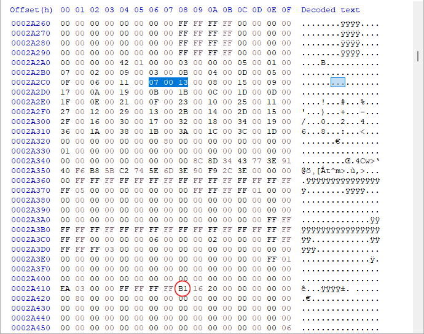
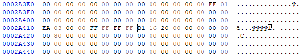
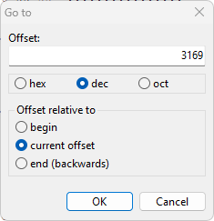
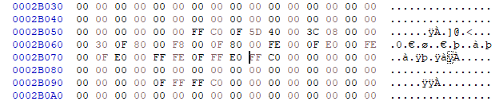
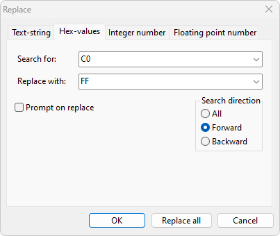
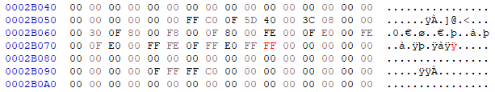

<br />
<div align="center">
  
</div>
<br />
<h1 align="center">bloodborne-isz-glitch-cure</h1>
<br />

## Table of Contents

- [Introduction](#introduction)
  - [What is the Bloodborne Isz Glitch](#what-is-the-bloodborne-isz-glitch)
  - [What is the Bloodborne Isz Glitch Cure](#what-is-the-bloodborne-isz-glitch-cure)
- [What causes a character to Isz Glitch](#what-causes-a-character-to-isz-glitch)
- [How to know if a character may be affected by Isz Glitch](#how-to-know-if-a-character-may-be-affected-by-isz-glitch)
  - [Check the characters inventory for related items](#check-the-characters-inventory-for-related-items)
  - [Check by play testing Isz chalices](#check-by-play-testing-isz-chalices)
  - [Check the event flags Hex value](#check-the-event-flags-hex-value)
- [How to cure the Isz Glitch](#how-to-cure-the-isz-glitch)
- [Cure the Isz Glitch](#cure-the-isz-glitch)
  - [How to cure the Isz Glitch on a regular PS4](#how-to-cure-the-isz-glitch-on-a-regular-ps4)
  - [How to cure the Isz Glitch on a jailbroken PS4](#how-to-cure-the-isz-glitch-on-a-jailbroken-ps4)
  - [How to cure the Isz Glitch on PC](#how-to-cure-the-isz-glitch-on-pc)
- [Conclusion](#conclusion)
  - [How to know that the cure has helped](#how-to-know-that-the-cure-has-helped)
- [Resources](#resources)
- [Contributing](#contributing)
- [Credits](#credits)
- [License](#license)

---

## Introduction

> **Note** 
>
> The quick code has been updated in February 2024 with the help of foxyhooligans to ensure that a character who has not yet looted all unique Isz items can still loot them after applying the patch. For more info on the Quick Code see this [Gist](https://gist.github.com/jrson83/11263531d557603ad12b45b98d227502). For new info related flags, see the note in [Modify the savegame with a HexEditor like HxD](#3-modify-the-savegame-with-a-hexeditor-like-hxd).  
>
> Also note that the new Quick Code has not been published to [Apollo Save Tool](https://github.com/bucanero/apollo-ps4) yet. I will update this info accordingly.
>
> The [patches](https://github.com/bucanero/apollo-patches/pull/4) for [Guidance tier 3](https://www.bloodborne-wiki.com/2015/11/guidance.html) rune and [Revered Great One Coldblood](https://www.bloodborne-wiki.com/2017/05/revered-great-one-coldblood.html), can be applied directly with [Apollo Save Tool](https://github.com/bucanero/apollo-ps4) or using [Save Wizard](https://www.savewizard.net/).

This guide is intended to help Bloodborne players access the cure to Isz Glitch, that was discovered, but not widely distributed.

- The instructions on how to cure the glitch were created by adopting the original [Isz Glitch Cure Guide](./assets/chalice-flag-unlocking-and-isz-glitch-cure-by-azureevening.jpg) created by [AzureEvening](https://www.youtube.com/@azureevening9696).
- Portions of the guide are created by adopting the original content from [Isz Glitch collection/information at bloodborne-wiki.net](https://www.bloodborne-wiki.com/2018/02/isz-glitch.html).

### What is the Bloodborne Isz Glitch

> The Isz Glitch is a bug in [Bloodborne](https://www.fromsoftware.jp/ww/detail.html?csm=094) that prevents certain characters from creating all possible Isz dungeons. This glitch is tied to unique coffin items you pick up from these dungeons and will therefore progress the more of these items you pick up.

The bug was discovered and published in February 2018 by members of the reddit community [Bloodborne: The Tomb Prospectors](https://www.reddit.com/r/tombprospectors/).

**Related Links:**

- [The dungeon breaking Isz glitch - summary](https://www.reddit.com/r/bloodborne/comments/7vmary/the_dungeon_breaking_isz_glitch_summary/)

> For nearly a year it wasn't known what causes this glitch that doomed the characters to repeatedly generate the same [...] dungeons over and over again [...]

In November 2019 an announcement was published, stating that the Tomb Prospectors finally figured out what causes this glitch.

> The Isz Glitch is caused by looting unique coffin items in Isz dungeons [...] The glitch happens gradually. Every time you loot a unique Isz coffin item, the number of Isz dungeons your character can create gets reduced. The moment you collect all unique Isz coffin items, your character becomes entirely glitched. Once a character is glitched, there’s no way out of it.

**Related Links:**

- [Isz Glitch, cracked and explained](https://www.reddit.com/r/bloodborne/comments/9zq34f/isz_glitch_cracked_and_explained/)

### What is the Bloodborne Isz Glitch Cure

In December 2020, a cure to end the isz glitch was discovered by the the Tomb Prospector [AzureEvening](https://www.youtube.com/@azureevening9696). The instructions on how to fix the bug by editing a particular hex value within the affected characters savegame, were published by AzureEvening on the [Tomb Prospectors Discord](https://discord.gg/Ax6YByr) eventually, however, the information was published but not disseminated further, unfortunately.

> The discovery is a potential game-changer in the hunt for gems in chalice dungeons.

**Related Links:**

- [Chalice Flag Unlocking and Isz Glitch Cure by AzureEvening (Dec, 2020)](./assets/chalice-flag-unlocking-and-isz-glitch-cure-by-azureevening.jpg)
- [Isz Glitch collection/information at bloodborne-wiki.net](https://www.bloodborne-wiki.com/2018/02/isz-glitch.html)

---

## What causes a character to Isz Glitch

Please make sure to read the following explanation which was extracted from bloodborne-wiki.net [Isz Glitch](https://www.bloodborne-wiki.com/2018/02/isz-glitch.html) summary, to fully understand the cause of the glitch.

- Dungeons are not randomly generated. Instead, they are pre-set layouts the player generates from an existing pool. This revelation is what lead Tomb Prospectors to start an organized exploration to map all possible dungeon variations.
- Each root chalice has 100-200 possible layouts the player can pull. Isz root supposedly has 200 layouts.
- The estimated total number of root dungeons is 2200. This number might be slighly off because recent exploration of Cursed and Defiled Root seems to indicate there are more than 100 layouts for this Root.
- All dungeons are internally sorted into a total of 15 groups (numbering starting from 0 to 14) with various amount of dungeons in each group based on dungeon depth and type. All of these groups are present in depth 5 Pthumeru and Loran **while Isz only uses 12 groups** [...]
- It became apparent that each group is related to one unique coffin item, and in Isz, by looting an item from certain group this group will become forever locked away for your character.
- From this it’s obvious it’s very easy to get in the glitch since you can usually get more than one unique item in one dungeon. Practically, it can only take 5 or less dungeons to get your character glitched depending on which items you loot. This applies to looting items by using glyphs and false depth dungeons as well. Selling and/or discarding Isz runes and weapons will not get you out of the glitch. The event flag has been set, and the game still remembers you had these items, even if you get rid of them.

## How to know if a character may be affected by Isz Glitch

There are 11 unique coffin items in Isz you can only loot once. The only way to avoid the glitch is to not collect unique items in the [coffins](https://www.bloodborne-wiki.com/2020/01/blood-gems-in-coffins-and-chests.html) of Isz and Sinister Isz root side areas. Looting an item in one will reduce the number of dungeons in the other as well.

As you can see below in the table, groups 10 and 11 are marked with `?` as these two groups of dungeons are the final Isz Glitch phase.
Tomb Prospectors still don’t know for sure why these two groups are repeating and there are only theories. One such theory hints that dungeons in these groups should include loot that's for some reason missing or has been removed but the game is still trying to give you a dungeon that's tied to an item that's no longer in there, and ultimately gets stuck in a loop (aka Isz Glitch).

The following text was extracted from a conversation with AzureEvening on Jan 31th 2023.

> Every dungeon has a list of items to obtain from them, getting these items will reduce your dungeon pool as the game tries to lead you to the ones you are missing. Once you obtain all special chest items, you can then generate any dungeon again. Isz has an item that doesn't exist and thus you can never get, making it so your dungeon list never goes back to being completed.

The only two dungeon items that come to mind is [Guidance tier 3](https://www.bloodborne-wiki.com/2015/11/guidance.html) rune and [Revered Great One Coldblood](https://www.bloodborne-wiki.com/2017/05/revered-great-one-coldblood.html). Both of these items are in the official Bloodborne guide but are unobtainable in the game by normal means. They still exist in the files though, as it is possible to save edit them into your inventory. They just don’t have any drop table assigned to them.

> **Note**  
>
> The [patches](https://github.com/bucanero/apollo-patches/pull/4) for [Guidance tier 3](https://www.bloodborne-wiki.com/2015/11/guidance.html) rune and [Revered Great One Coldblood](https://www.bloodborne-wiki.com/2017/05/revered-great-one-coldblood.html), can be applied directly with [Apollo Save Tool](https://github.com/bucanero/apollo-ps4) or using [Save Wizard](https://www.savewizard.net/).

### Check the characters inventory for related items

- Once a weapon is looted, it will be available for purchase from the [Bath Messengers](https://www.bloodborne-wiki.com/2015/03/bath-messengers.html). So one way is to check their offer.
- Once a [caryll-rune](https://www.bloodborne-wiki.com/p/caryll-runes.html) is looted, it will be available in your inventory. If you did not sell the rune it should be in there.
- Blood Rocks can be obtained in various locations, so there is no way to tell.

> Layer 4 Nourishing gem is not a part of glitch, it's a generic treasure that can be looted many times.
>
> -- <cite>Beastmaster's Damp Blood Gem</cite>

**The groups and related items:**

| Group    | Unique item                                                                                 |
| -------- | ------------------------------------------------------------------------------------------- |
| Group 0  | [Ludwig’s Lost Holy Blade](https://www.bloodborne-wiki.com/2015/03/ludwigs-holy-blade.html) |
| Group 1  | [Lost Kirkhammer](https://www.bloodborne-wiki.com/2015/03/kirkhammer.html)                  |
| Group 2  | [Lost Threaded Cane](https://www.bloodborne-wiki.com/2015/03/threaded-cane.html)            |
| Group 3  | [Great Deep Sea](https://www.bloodborne-wiki.com/2015/03/great-deep-sea.html)               |
| Group 4  | [Deep Sea](https://www.bloodborne-wiki.com/2015/03/deep-sea.html)                           |
| Group 5  | [Great Lake](https://www.bloodborne-wiki.com/2015/09/great-lake.html)                       |
| Group 6  | [Arcane Lake](https://www.bloodborne-wiki.com/2015/03/arcane-lake.html)                     |
| Group 7  | [Eye](https://www.bloodborne-wiki.com/2015/03/eye.html)                                     |
| Group 8  | [Blood Rock](https://www.bloodborne-wiki.com/2015/03/blood-rock.html)                       |
| Group 9  | % Arcane gem / % layer 4 Nourishing gem                                                     |
| Group 10 | ?                                                                                           |
| Group 11 | ?                                                                                           |

### Check by play testing Isz chalices

Start a testing session and create multiple Isz chalices in a row with your character. Use the [Chalice Dungeons Exploration Sheet](https://docs.google.com/spreadsheets/d/1psfenhcQJ06EUQgcEHBIQcfLD5Iq-kyKGTZINvy6228) (Isz or Sinister Isz tab) in combination with the [Chalice Dungeon Screenshot Database](https://mega.nz/#F!ErIi3ToL!JStdKoZ6Nqx7TF29e3_5Sg).

The following data from the sheet should help you to determine a characters location:

1. FRC offers
2. Layer 1 - 3 Bosses
3. Notes
4. Main Layout - The starting point when using the screenshot db
5. Bonus Room

Once you have figured out how to use the screenshot database, you should be able to determine the exact ID of your characters dungeon in a short time. The glitch related IDs `1 - 32` are located at the end of the sheets.

If you collect every possible coffin while playing through multiple chalices, items that you may have looted already will be replaced by either [Madman’s Knowledge](https://www.bloodborne-wiki.com/2015/03/madmans-knowledge.html) or [Great One’s Wisdom](https://www.bloodborne-wiki.com/2015/03/great-ones-wisdom.html) - this indicates that there is an event flag for each of these items that keeps track of what item you’ve already looted.

### Check the event flags Hex value

Following the next chapter, you should be able to determine the particular hex value within the affected characters savegame. The byte has the possibility of being 4 things, `00`, `40`, `80`, or `C0`. A fully maxed out Isz with the glitch looks like `C0`, which means the character has looted every unique Isz item and the other 3 being partial glitch (info by foxyhooligans).

> **Tip:** It is easier to cure the Isz Glitch after you looted all items or before looting any.

## How to cure the Isz Glitch

In order to cure a characters Isz Glitch, we have to modify the related flags within the characters decrypted PS4 savegame.

We can do this by either using the  Quick Code which can be applied to a savegame using [Save Wizard](https://www.savewizard.net/), [Apollo Save Tool library](https://github.com/bucanero/apollo-lib) or [Apollo Save Tools](https://github.com/bucanero/apollo-ps4) or manually.

```sh
[Isz Glitch Cure]
80010008 03000000 - Searches for 8 bytes of 03 00 00 00 05 00 01 00 once using Default Offset
05000100 00000000
92000000 00000DD1 - Adjusts the pointer offset by adding a value of 3537 dec = DD1 hex to the pointer
D8000000 020130FF - Tests and skips the following two code lines if 2 bytes from pointer equal `FF 30`
D8000000 0103C0FF - Tests and skips the following code line if 2 bytes from pointer equal less than `FF C0`
08000001 00000030 - Writes 1 byte with 1 offset from pointer, replacing a value less than `C0` with `30` (partial Isz glitch fix)
D8000000 0100C0FF - Tests if 2 bytes from pointer equal `FF C0`, skips the following code line if operation fails
08000001 000000FF - Writes 1 byte with 1 offset from pointer, replacing `C0` with `FF` (fully maxed out Isz glitch fix)
```

Here is an example output when using the patch with Apollo Save Tool library:

```sh
❯ ./patcher userdata0000.savepatch 1 userdata0000

Apollo cheat patcher v0.6.0 - (c) 2022 by Bucanero

[i] Applying codes [1] to userdata0000...

[+] Applying code #1...
- Game Genie Code
- Applying [Isz Glitch Cure] to 'userdata0000'...
- Searching (len=8 count=1) ...
- ----- Search 8 bytes -----
- 000000: 03 00 00 00 05 00 01 00                          | ........
- ----- Search 8 bytes -----
- Search pointer = 152720 (0x25490)
- Pointer set to offset 0x26261 (156257)
- Byte Test (00026261) C0FF != 30FF
- Byte Test (00026261) C0FF < C0FF
- Skipping 1 lines...
- Byte Test (00026261) C0FF = C0FF
- Wrote 1 bytes (FF) to 0x26262
- OK

Patching completed: 1 codes applied
```

For more info on the Quick Code see this [Gist](https://gist.github.com/jrson83/11263531d557603ad12b45b98d227502).

## Cure the Isz Glitch

From here the guide will show two possible solutions:

1. [How to cure the Isz Glitch on a regular PS4](#how-to-cure-the-isz-glitch-on-a-regular-ps4)
2. [How to cure the Isz Glitch on a jailbroken PS4](#how-to-cure-the-isz-glitch-on-a-jailbroken-ps4)

---

### How to cure the Isz Glitch on a regular PS4

If the character savegame is used on a regular PS4 console, you will need [Save Wizard for PS4 MAX Recommended](https://www.savewizard.net/), which unfortunately has to be paid for. Do not buy Save Wizard.online: PS4 Edition, since we need to use `advanced mode` which is only available in the MAX Edition.

#### Preperation

You will need the following:

- A regular PS4 with the characters savegame
- [Save Wizard for PS4 MAX Recommended](https://www.savewizard.net/)
- USB Stick

#### Step 1: Copy the savegame to USB

1. **Connect** a USB storage device to the PS4 system.
2. **Go** to Settings > Application Saved Data Management > Saved Data in System Storage > Copy to USB Storage Device.
3. **Select** Bloodborne.
4. **Select** Copy.

#### Step 2: Modify the savegame with Save Wizard

1. **Connect** the USB storage device to the PC.
2. **Run** Save Wizard. It should load the Bloodborne savegame from the USB drive.

#### Step 3: Save Wizard Quick Code (experimental)

Please follow the tutorial [How to Add Quick Code On Save Wizard](https://xdgmods.com/how-to-add-quick-code-on-save-wizard/) from xdgmods.com.

```sh
[Isz Glitch Cure]
80010008 03000000
05000100 00000000
92000000 00000DD1
D8000000 020130FF
D8000000 0103C0FF
08000001 00000030
D8000000 0100C0FF
08000001 000000FF
```

> **Warning**  
> This is experimental and needs to be tested. Remember to always backup your savegame!

#### Step 4: Copy the savegame back to PS4 HDD

1. **Connect** the USB storage device to the PS4 system.
2. **Go** to Settings > Application Saved Data Management > Saved Data on USB Storage Device > Copy to System Storage.
3. **Select** Bloodborne.
4. **Select** Copy.

Skip to [Conclusion](#conclusion).

---

### How to cure the Isz Glitch on a jailbroken PS4

On a jailbroken PS4, there are several ways to cure the glitch:

1. Apply the Quick Code using [Apollo Save Tool](https://github.com/bucanero/apollo-ps4) (recommended)
2. Apply the Quick Code using [Apollo Save Tool library](https://github.com/bucanero/apollo-lib)
3. Modify the savegame with a HexEditor like [HxD](https://mh-nexus.de/en/hxd/)

---

#### Preperation

You will need the following, depending on your prefered way to cure:

- A jailbroken PS4 with [Apollo Save Tool](https://github.com/bucanero/apollo-ps4)
- A jailbroken PS4, a Computer with [Apollo Save Tool library](https://github.com/bucanero/apollo-lib)
- [HxD](https://mh-nexus.de/en/hxd/) - Freeware Hex Editor and Disk Editor
- USB Stick (extFAT formatted)

#### Activate offline account

Make sure your offline PS4 account is activated.

1. **Run** Apollo Save Tool.
2. **Select** User Tools > Activate PS4 Accounts.

Your should see a list with all your accounts. An account is not activated when it has no auto-generated account ID, meaning `(0000000000000000)` following the username.

3. **Select** the account > Auto-generated Account ID.
4. **Exit** Apollo Save Tool.
5. **Restart** the PS4 console.
6. **Resign** your savegame files

If you need more help, check the video [PS4 Apollo Save Tool v1.4.0 Released](https://www.youtube.com/watch?v=tKgK7apPLTE) on YouTube.

---

#### 1. Apply the Quick Code using [Apollo Save Tool](https://github.com/bucanero/apollo-ps4) (recommended)

1. **Run** Apollo Save Tool.
2. **Select** HDD Saves > Bloodborne (choose the correct CUSA).
3. **Scroll** to the bottom of the cheat list.

> **Warning**  
> Remember to always backup your savegame!

4. **Select** `Isz Glitch Cure (Character must be affected by Isz Glitch)`.
5. **Expect** the patching completed and you should be done.

Skip to [Conclusion](#conclusion).

> Furthermore I created patches for [Guidance tier 3](https://www.bloodborne-wiki.com/2015/11/guidance.html) rune and [Revered Great One Coldblood](https://www.bloodborne-wiki.com/2017/05/revered-great-one-coldblood.html).



---

#### 2. Apply the Quick Code using [Apollo Save Tool library](https://github.com/bucanero/apollo-lib)

##### Step 1: Copy the savegame to USB

1. **Connect** a USB storage device to the PS4 system.
2. **Run** Apollo Save Tool > From HDD > Select Bloodborne savegame > Copy to USB Storage Device.

The savegame will be copied into the folder:

```
PS4/APOLLO/XXXXXXXX_CUSAXXXXX_XXXXXXXX
              │         │        │
              │         │        └─⫸ Random ID?
              │         │
              │         └─⫸ Game Title ID Number
              │
              └─⫸ Account User ID
```

##### Step 2: Modify the savegame

1. **Download** and extract the latest release of [Apollo Save Tool library](https://github.com/bucanero/apollo-lib/releases).
2. **Copy** your savegame `userdata0000 - userdata0010` into the Apollo Save Tool library folder.
3. **Create** a file `userdata00XX.savepatch` > Copy & paste the following Quick Code:

```sh
[Isz Glitch Cure]
80010008 03000000
05000100 00000000
92000000 00000DD1
D8000000 020130FF
D8000000 0103C0FF
08000001 00000030
D8000000 0100C0FF
08000001 000000FF
```

> **Warning**  
> Remember to always backup your savegame!

4. **Open** a Terminal > Run `./patcher userdata00XX.savepatch userdata00XX`.
5. **Expect** the response `Patching completed: 1 codes applied` and you should be done.

Skip to [Conclusion](#conclusion).

---

#### 3. Modify the savegame with a HexEditor like [HxD](https://mh-nexus.de/en/hxd/)

> **Note**  
>
> Information by foxyhooligans:  
>
> If you want to apply the fix on a character who has not yet looted all unique Isz items, the byte has the possibility of being 3 things, `00`, `40`, `80`.  
> Instead of changing the byte to `FF`, change it to `30` and you still can loot unique isz items after applying the patch.

##### Step 0: Set the character spawn

1. **Start** Bloodborne and load the character you want to cure
2. **Position** the character at the initial spawn point in the [Hunter's Dream](https://www.bloodborne-wiki.com/2015/03/dream-refuge.html)
3. **Use** a lamp to transport back into Hunter's Dream. If you accidentally moved the character in the Dream, use a [Bold Hunter's Mark](https://www.bloodborne-wiki.com/2015/03/bold-hunters-mark.html) to reset to initial spawn.
4. **Press** Start > Settings > Quit > Close Bloodborne.

##### Step 1: Copy the savegame to USB

1. **Connect** a USB storage device to the PS4 system.
2. **Run** Apollo Save Tool > From HDD > Select Bloodborne savegame > Copy to USB Storage Device.

The savegame will be copied into the folder:

```
PS4/APOLLO/XXXXXXXX_CUSAXXXXX_XXXXXXXX
              │         │        │
              │         │        └─⫸ Random ID?
              │         │
              │         └─⫸ Game Title ID Number
              │
              └─⫸ Account User ID
```

##### Step 2: Modify the savegame

1. **Connect** the USB storage device to the PC.
2. **Create a backup of the PS4 folder located on the USB device!**
3. **Open** the folder `PS4/APOLLO/XXXXXXXX_CUSAXXXXX_XXXXXXXX`, you will see multiple files `userdata0000` - `userdata010`.
4. **Run** HxD goto File > Open > Select the file `userdata0000` from the USB device.
5. **Go** to Search > Find (or press `ctrg + F`). Select Hex-values tab and enter: `070013`. Press OK.



6. **Look** for 4 FFs, so `FF FF FF FF` followed by either `B1 16 20` or `A9 16 20` depending on your characters location.



7. Place the cursor between the last `FF` and `B1`.



8. **Go** to Search > Go to (or press `ctrg + G`) > Select `dec` & `current offset` > Enter `3169` > Press OK.



9. The cursor should be placed automatically at the first char of one `FF`, followed by `0C`.

> These two bytes represent the flags where the game registers having looted unique items from Isz. They change to FF when you have looted all the items indexed in them. The first one maxes out naturally, while the second one gets stuck on `C0` and fails to reach the maximum.  



10. **Go** to Search > Replace (or press `ctrg + R`) > Select `Hex-values` > Search for: `C0` > Replace with: `FF` > Press OK.



11. The `C0` should be replaced with a red colored `FF`.



12. **Select** File > Save

#### Step 3: Copy the savegame back to PS4 HDD

1. **Connect** the USB storage device to the PS4 system.
2. **Run** Apollo Save Tool > From USB > Select Bloodborne savegame > Copy to HDD.

---

### How to cure the Isz Glitch on PC

A mod has been released to fix the Isz glitch on PC with [ShadPS4](https://shadps4.net/), created by [bloodygood](https://next.nexusmods.com/profile/bloodygood?gameId=2708). The mod can be downloaded from Nexus Mods.

[Isz Chalice Glitch Fix plus Implements Chalice Unobtainables](https://www.nexusmods.com/bloodborne/mods/276?tab=description)

---

## Conclusion

Congratulations, your character is now Isz Glitch free :drop_of_blood:

### How to know that the cure has helped

- [Check by play testing Isz chalices](#check-by-play-testing-isz-chalices).

> The only ways to check if the glitch fix worked is to either use the screenshot database or check map IDs of generated dungeons in the save editor.
>
> -- <cite>Tringun</cite>

---

## Resources

General information.

- [Bloodborne: The Tomb Prospectors](https://www.reddit.com/r/tombprospectors/)
- [The Tomb Prospectors Discord](https://discord.gg/Ax6YByr)
- [The Tomb Prospectors' Resources, Guides and Studies](https://www.reddit.com/r/tombprospectors/comments/ok7wrz/the_tomb_prospectors_resources_guides_and_studies/)
- [The Tomb Prospectors Discoveries](https://www.bloodborne-wiki.com/p/the-tomb-prospectors-discoveries.html)

Isz Glitch related.

- [Isz Glitch, cracked and explained](https://www.reddit.com/r/bloodborne/comments/9zq34f/isz_glitch_cracked_and_explained/)
- [Isz Glitch, cracked and explained (original thread)](https://old.reddit.com/r/tombprospectors/comments/9zgzlp/isz_glitch_cracked_and_explained/)
- [Isz Glitch and gem farming: an overview of the common 32](https://www.reddit.com/r/tombprospectors/comments/fxt44w/isz_glitch_and_gem_farming_an_overview_of_the/)
- [Guide to Offline Prospecting (by Grzester23)](https://docs.google.com/document/d/1Zb4UMKnTyho5zeIA0qxtOySfDkg7iZ0mYLxPK6KAhkQ/edit?usp=drivesdk)
- [Offline gem farming guide](https://docs.google.com/document/d/1-od0IHTIIunVc2xjmLVEWmSSila4w636rrqpoSDMCY8/edit#heading=h.m310ugrnp0av)
- [Prospector exploration sheet of all root dungeons](https://docs.google.com/spreadsheets/d/1psfenhcQJ06EUQgcEHBIQcfLD5Iq-kyKGTZINvy6228/edit#gid=1131786800)
- [Chalice Dungeons Exploration Sheet](https://docs.google.com/spreadsheets/d/1psfenhcQJ06EUQgcEHBIQcfLD5Iq-kyKGTZINvy6228)
- [Chalice Dungeon Screenshot Database](https://mega.nz/#F!ErIi3ToL!JStdKoZ6Nqx7TF29e3_5Sg)

Isz Glitch Cure related.

- [Chalice Flag Unlocking and Isz Glitch Cure by AzureEvening (Dec, 2020)](./assets/chalice-flag-unlocking-and-isz-glitch-cure-by-azureevening.jpg)
- [Isz Glitch collection/information at bloodborne-wiki.net](https://www.bloodborne-wiki.com/2018/02/isz-glitch.html)
- [Isz Chalice Glitch Fix plus Implements Chalice Unobtainables (PC)](https://www.nexusmods.com/bloodborne/mods/276?tab=description)

Hex editing related.

- [Tomb Prospectors - Hex Research Central](https://docs.google.com/spreadsheets/d/1zFIzhnXHhYomlR-tFJcyk3cPywf1snqkDH900j6rtAI/edit#gid=1741467922)
- [Bloodborne Master Spreadsheet (Public)](https://docs.google.com/spreadsheets/d/1uty5UD7fdiLSAPn7mG648SZu9iL5xonZodJF9X8HIuY/htmlview)
- [Bloodborne Respec: How to change starting origin](https://imgur.com/a/UvVnpXU)
- [Bloodborne - Gems, Rune and Armor HEX ID's](https://playersquared.com/forums/40-games/1681-bloodborne-gems-rune-armor-hex-ids-archive.html)

Tools related.

- [Save Wizard for PS4 MAX Recommended](https://www.savewizard.net/)
- [Apollo Save Tool](https://github.com/bucanero/apollo-ps4)
- [Apollo Save Tool library](https://github.com/bucanero/apollo-lib)
- [HxD](https://mh-nexus.de/en/hxd/)

## Contributing

All contributions are welcome. Feel free to submit a pull request to improve this guide.

### Contributing Guidelines

Please read our [CONTRIBUTING](https://github.com/jrson83/bloodborne-isz-glitch-cure/blob/main/CONTRIBUTING.md) guide and [CODE OF CONDUCT](https://github.com/jrson83/bloodborne-isz-glitch-cure/blob/main/CODE_OF_CONDUCT.md) for more information.

### Contributors ✨


## Credits

All credits go to the authors of the actual articles.

- The instructions on how to cure the glitch were created by adopting the original [Isz Glitch Cure Guide](./assets/chalice-flag-unlocking-and-isz-glitch-cure-by-azureevening.jpg) created by [AzureEvening](https://www.youtube.com/@azureevening9696).
- Portions of the guide are created by adopting the original content from [Isz Glitch collection/information at bloodborne-wiki.net](https://www.bloodborne-wiki.com/2018/02/isz-glitch.html).
- Image: [bloodborne-bell.png](./assets/bloodborne-bell.png) - License: Non-commercial Use - From [pngaaa.com](https://www.pngaaa.com/detail/1961431) - Bloodborne Bell

## License

This project is [MIT](https://github.com/jrson83/bloodborne-isz-glitch-cure/blob/main/LICENSE) licensed.
